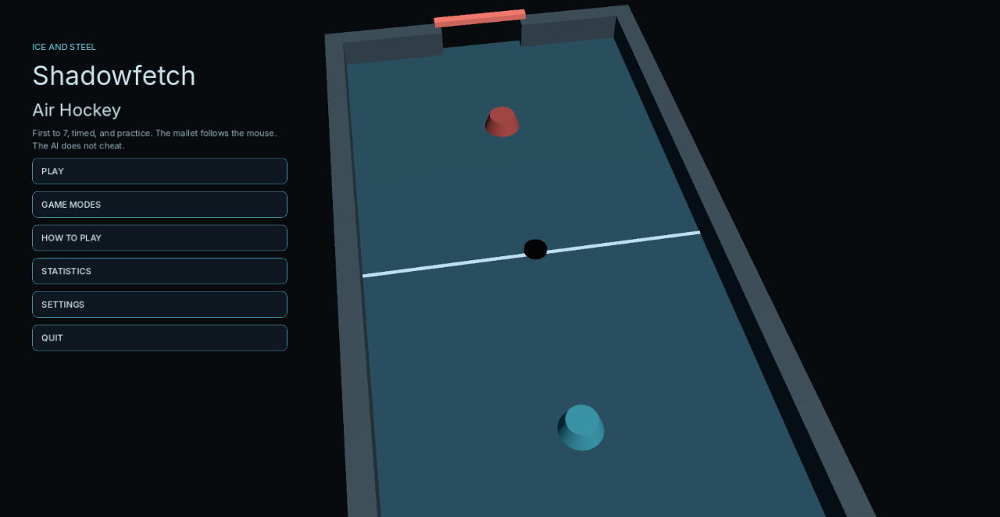
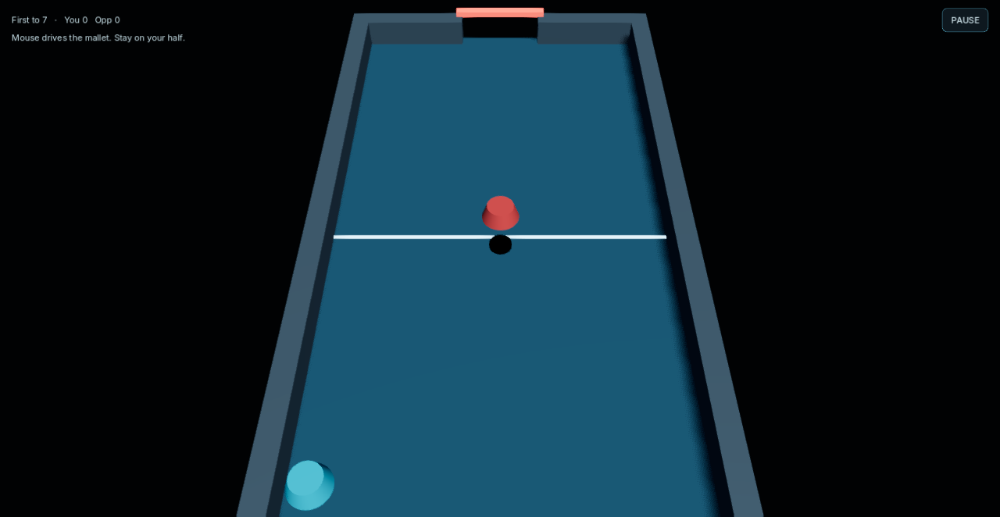

# Shadowfetch Air Hockey

First to 7, timed, and practice for Linux. Immediate mallet, Jolt puck, no cheat AI. Sibling to the other Shadowfetch table games — ice and steel, not a clone.





## Download

Get `shadowfetch-air-hockey-1.0.0-linux-x86_64.tar.gz` from the [latest release](https://github.com/Shadowfetchapps/shadowfetch-air-hockey/releases/latest) (x86_64 Linux), then:

```bash
sha256sum -c shadowfetch-air-hockey-1.0.0-linux-x86_64.tar.gz.sha256
tar -xzf shadowfetch-air-hockey-1.0.0-linux-x86_64.tar.gz
cd shadowfetch-air-hockey-1.0.0-linux-x86_64
./tools/install_linux.sh
```

## Run

```bash
shadowfetch-air-hockey
```

Installer copies the release binary to `~/.local/opt/shadowfetch-air-hockey`.

## Tests

```bash
./tools/run_tests.sh
```

Covers first-to-7, timed, practice, single-score goals, 12,000 trajectories, mallet storms, and 3,000 high-speed shots. Settings recover from corrupt files.

## Export and install

```bash
./tools/export_linux.sh
./tools/install_linux.sh
```

If `rsvg-convert` is missing: `sudo apt install librsvg2-bin desktop-file-utils`

## Controls

- Mouse moves the mallet on your half
- Local: WASD for the far mallet
- Esc pauses

## Assets

Inter fonts — SIL OFL 1.1. Table, puck, icon, and audio are original.

No telemetry.
